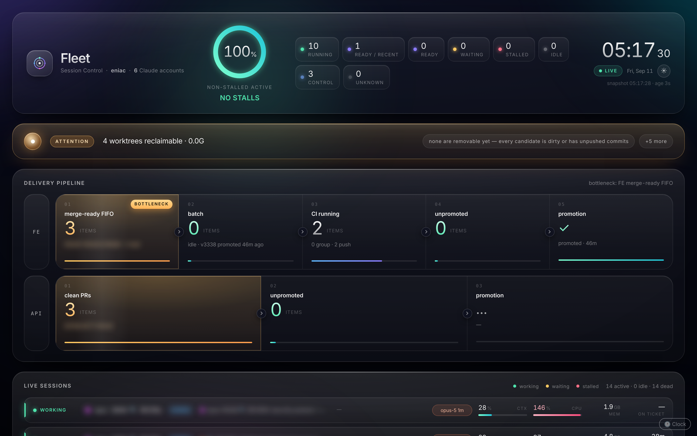

<h1 align="center">Hi 👋, I'm Matt Riddell</h1>
<h3 align="center">Software developer from New Zealand, based in Panama 🇵🇦</h3>

  
  
  

Most of my ~200 repositories are private, so there is not much to see here. Hit me up if you're curious.

## What I'm building

- **CTO at [Group Advisors](https://www.groupadvisors.com)** — a US employee-benefits platform (wellness programs, affiliate and employer portals, payroll integrations, billing, e-signature, an employee mobile app).
- **An Agentic OS** — my own operating system for software delivery run by AI agents. A controller seat plans and promotes, a warden answers and routes, worker lanes claim tickets from an in-house board, and a deterministic pipeline merges, builds staging, verifies and promotes to production. Dozens of agents work in parallel on one Linux box, around the clock, with humans only answering real decisions.
- **Also active across my other companies:** NeoGen.AI, COVID Schedule, VentureVoIP, CreateOffshoreCompany, SineApps, VentureIP, C O International Holdings, Bio Earth Farms, Light Stream Farms and Singularity Software.

  
   The fleet dashboard I built for the Agentic OS — live sessions, the delivery pipeline and capacity, on one screen. Ticket, PR and account details blurred.

## Our own CI/CD, built from scratch

We stopped paying for hosted CI runners (GitHub-hosted minutes first, then Blacksmith) and replaced the whole path with our own:

- **A merge-ready FIFO** that agents hand finished PRs into, instead of a hosted merge queue.
- **One combined batch** every 30 minutes: rebase the queued PRs onto fresh main, run a single compile / lint / changes-only test / catalog / help gate, merge the integration branch.
- **One staging build** from a source tarball via the Heroku Build API, verified by served commit and health, then **promoted as the exact slug** to production. Production is a copy, never a second build.
- **Automatic triage**: a failed gate is attributed to the culprit PR, which is held with the exact error while the rest of the batch relaunches without it.
- **Self-hosted runners on our own Linux box** for the few scheduled jobs that still use GitHub Actions; the security scans, nightly suites and hourly full test runs are systemd timers.
- Everything writes a machine-readable verdict line; nothing is "green" without evidence.

## How I work with AI

I don't use AI as an autocomplete; I run it as a workforce.

- **Models:** Anthropic Claude (Fable / Opus 5 for control and judgment), Zhipu GLM 5.3 for volume work, OpenAI Codex models, xAI Grok, plus local models via Ollama.
- **Tools:** Claude Code, T3 Code, opencode and Codex CLI as agent runtimes; systemd timers for the deterministic parts; Telegram for the human loop; Playwright for browser verification; self-hosted GitHub Actions runners; Heroku for delivery.
- **Principles:** everything in production is verified by evidence, not by a green check; agents claim work with locks and audit trails; every decision is recorded with who said it and when; and anything that is done twice by hand becomes a script or a timer.

## Stack

TypeScript · React · Vite · Tailwind · LoopBack 4 / Node.js · MySQL · Heroku · Expo / React Native · Firebase · Playwright · Jest · GitHub Actions · Linux / systemd · Python
